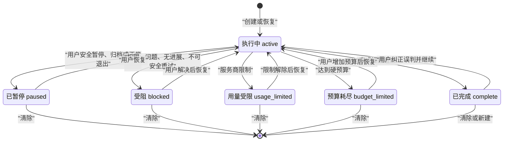
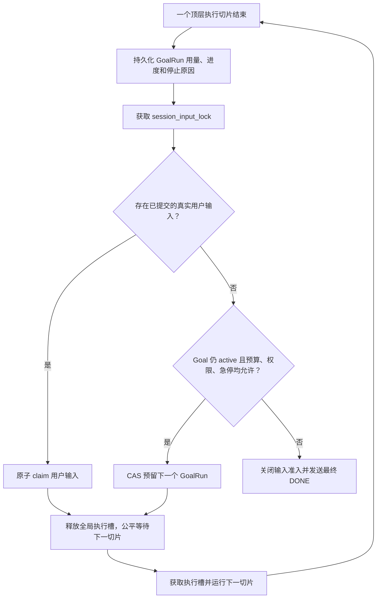

# 目标模式（`/目标`）产品与开发计划

状态：本地桌面稳定实现（默认开启）
日期：2026-07-15
目标：为苏小有增加会话级、跨多轮、可暂停、可恢复、受预算和权限约束的自主续跑能力。

## 0. 实施与发布快照

截至 2026-07-15，本文的本地桌面稳定范围已经实现，`GOALS_RELEASED` 与
`AUTONOMOUS_GOALS_RELEASED` 默认开启。已落地内容包括：

- `/目标` 与 `/goal` 的创建、查看、编辑、暂停、继续和清除命令；
- 会话级 `SessionGoal`、逐切片 `GoalRun`、幂等用量账本和 Goal 关联 Todo；
- 用户输入优先、逐切片公平调度、安全暂停、急停、归档、删除和退出恢复；
- Token、模型费用、活跃时间、自主轮数预算，以及无进展、连续错误和用量限制断路器；
- 创建时权限上限与当前策略取交集，当前策略只能收紧，子任务不能扩权；
- 本地桌面 Goal 卡片、状态、SSE 运行事件、刷新恢复及会话列表/搜索摘要。

当前“稳定”特指受本机桌面会话令牌保护的单客户端工作流，不代表云端后台执行、远程移动端或
多窗口实时协同：

- Goal API 只接受本地桌面会话，Remote、消息渠道和 `/m/new` 不提供 Goal 创建入口；
- 同一活动 stream 的订阅者可重放运行事件；REST 编辑、暂停和清除由发起操作的客户端直接更新缓存，
  其他窗口不会收到会话级广播，重新聚焦或刷新后以数据库状态收敛；
- 应用退出后不会在云端继续；不确定的在途副作用在重启后标记为需要审查，绝不自动重放；
- Goal 的费用预算累计 Provider 上报的模型费用。无法统一换算的第三方付费工具费用不并入该预算，
  这类工具仍必须逐次获得不可覆盖的付费确认。

发布验证快照见本文第 15 节；苏小有 `1.0.0` 整体发行仍受安装包、签名、公证和真实服务等独立门禁
约束，不能把 Goal 功能稳定等同于整个版本已 GA。

## 1. 决策摘要

苏小有具备实现目标模式的基础，但不能把现有 Todo 或 Automation Loop 政名后直接使用。

- Goal 是一个会话内唯一、跨多轮持久存在的“完成契约”。
- Todo 是 Goal 在当前阶段的步骤拆解，仍由助手维护。
- 普通用户消息永远优先于自动续跑，但不会隐式改写 Goal。
- 模型停止输出不等于 Goal 完成；完成必须显式提交证据并通过服务端校验。
- Goal 不扩大权限；权限、问题或计划确认无法继续时进入等待或阻塞状态。
- 应用重启后不自动重放结果不确定的工具调用，必须让用户检查后恢复。
- 每个自主运行周期使用一个连续 SSE stream；暂停、阻塞、达到预算或完成后才发送最终 `DONE`。

OpenAI 对 `/goal` 的公开定义也是“跨多轮朝可验证停止条件持续工作的持久目标”，并支持查看、编辑、暂停、恢复和清除。官方同时建议目标包含结果、约束和验证标准，并明确 Goal 不会扩大原有权限边界：

- [Follow a goal](https://developers.openai.com/codex/use-cases/follow-goals)
- [Developer commands](https://learn.chatgpt.com/docs/developer-commands?surface=cli)
- [Long-running work](https://learn.chatgpt.com/docs/long-running-work)

## 2. 产品契约

### 2.1 Goal 与 Todo 的关系

| 概念 | 生命周期 | 维护者 | 作用 |
| --- | --- | --- | --- |
| Goal | 会话级，跨多轮和应用重开持久化 | 用户创建和控制；模型只能报告完成或阻塞 | 定义要达到的结果、约束、完成条件和自主执行边界 |
| Todo | 当前 Goal 或当前普通任务的步骤级清单 | 助手 | 展示待处理、进行中、已完成的执行步骤 |
| GoalRun | 一次初始执行、用户输入处理或自动续跑切片 | 运行时 | 记录幂等、用量、停止原因和崩溃恢复信息 |

每个会话最多一个当前 Goal。新建 Goal 时清理旧 Goal 的 Todo；暂停、恢复和普通用户消息不清理 Todo。

### 2.2 命令

中文和英文命令完全等价：

| 命令 | 行为 |
| --- | --- |
| `/目标 <内容>`、`/goal <objective>` | 新建 Goal；已有 Goal 时进入编辑确认 |
| `/目标`、`/goal` | 打开当前 Goal 详情或空态 |
| `/目标 编辑 <内容>`、`/goal edit <objective>` | 编辑目标，下一安全边界生效 |
| `/目标 暂停`、`/goal pause` | 请求安全暂停 |
| `/目标 继续`、`/goal resume` | 恢复自主续跑 |
| `/目标 清除`、`/goal clear` | 二次确认后清除 Goal |

解析规则：

- 只识别输入开头的精确命令；正文中的 `/目标`、`/goals` 和 `//目标`按普通消息发送。
- 英文大小写不敏感；支持多行目标；仅裁剪首尾空白。
- 目标和完成条件合计不超过 4,000 个字符。
- 命令必须在发送普通消息和排队逻辑之前解析，不能把命令字面量发给模型。
- Preview 阶段不允许 Goal 命令携带附件，失败时必须原样恢复输入和附件；Beta 阶段由原子启动接口支持附件。
- Landing、新会话、已有会话和移动端必须复用同一个纯命令解析器。

### 2.3 明确不做

首个稳定版本不包含：

- 一个会话同时运行多个 Goal；
- 把 Goal 当成无关事项的长期 backlog；
- 应用退出后继续在云端运行；
- 应用重启后自动重放最后一个不确定 GoalRun；
- 模型自行创建、删除、恢复 Goal 或提高预算；
- 因启用 Goal 自动扩大文件、命令、网络、MCP 或付费工具权限。

## 3. 状态机

产品状态与运行状态分开，避免把“目标仍有效”和“当前是否正在调用模型”混成一个字段。

产品状态：

- `active`：允许继续执行；
- `paused`：用户或系统已安全暂停；
- `blocked`：需要用户处理、没有进展或发生不可安全重试的错误；
- `usage_limited`：服务商用量或速率限制；
- `budget_limited`：Token、费用、活跃时间或自主轮数达到硬限制；
- `complete`：完成证据已通过校验。

内部运行状态：

- `idle | reserved | running | pausing | waiting_user | interrupted`。



编辑活动 Goal 时先写入新 revision，并让当前 GoalRun 在安全边界结束；下一 GoalRun 使用新内容。公开状态仍可保持 `active`，内部运行状态显示 `pausing` 或“正在应用修改”。

## 4. 持久化设计

### 4.1 `session_goal`

每个 Session 最多一条当前 Goal：

```text
id
session_id UNIQUE FK session.id ON DELETE CASCADE
objective TEXT
definition_of_done TEXT NULLABLE
status
run_state
revision

token_budget / tokens_used
cost_budget_microusd / cost_used_microusd
time_budget_seconds / time_used_seconds
max_continuations / continuation_count
no_progress_count / blocker_streak / consecutive_error_count

blocker_code / blocker_message / needs_review / next_retry_at
completion_summary / completion_evidence JSON

model_id / provider_id / agent / reasoning / language
permission_snapshot JSON
last_run_id / last_stream_id
time_started / time_completed / time_created / time_updated
```

要求：

- `revision` 所有编辑、暂停、恢复、清除和运行预留均通过 CAS 更新。
- 费用使用整数 micro-USD，避免浮点累计误差。
- 权限快照由服务端生成，不接受客户端伪造，也不保存密钥。
- 当前安全策略可以收紧既有 Goal；后续全局放宽不能自动扩大既有 Goal 权限。

### 4.2 `goal_run`

每次初始运行、用户插队处理或自动 continuation 都写入运行账本：

```text
id
goal_id FK session_goal.id ON DELETE CASCADE
ordinal
goal_revision
idempotency_key
stream_id
trigger: initial | auto | resume | user_input
status: reserved | running | waiting_user | completed | blocked | interrupted | failed

tokens_used / cost_used_microusd / active_seconds
progress_summary / stop_reason / error_code
lease_owner / lease_expires_at
side_effects_started
time_started / time_finished / time_created / time_updated
```

约束：

- `UNIQUE(goal_id, ordinal)`；
- `UNIQUE(idempotency_key)`；
- 同一个 Goal 最多一个 `reserved/running/waiting_user` GoalRun；
- 预留必须使用条件更新，两个并发 `resume` 只能成功一个。

### 4.3 `goal_usage_record`

迁移 `0009_v100_goal_usage_ledger` 为每个 Provider、compaction 或子任务用量来源写入幂等账本：

```text
id
goal_run_id FK goal_run.id ON DELETE CASCADE
source_kind / source_key
tokens_used / cost_used_microusd
time_created / time_updated
```

`UNIQUE(goal_run_id, source_key)` 防止断线回调、重复持久化或恢复核算造成重复计费。运行完成和启动恢复
都从这份持久账本汇总，不依赖进程内计数器。迁移 `0008_v100_session_goal` 创建 Goal 控制面并给 Todo
增加关联；`0009` 只增加用量账本。升级继续走现有的备份、staging 迁移、完整性检查和原子替换流程；
正式数据库不执行原地降级，回滚使用升级前安全备份。

### 4.4 Todo 关联

为 `todo` 增加可空的 `goal_id`。Goal 激活时 Todo 工具自动带入当前 `goal_id`；Goal 暂停时的普通对话不应错误覆盖 Goal 的执行清单。完成校验只检查当前 Goal 关联的 Todo。

## 5. API 契约

建议新增 `backend/app/api/goals.py`：

| 方法 | 路径 | 用途 |
| --- | --- | --- |
| `POST` | `/api/chat/goal` | 原子创建会话（可选）、Goal、首个 GoalRun 和 stream |
| `GET` | `/api/sessions/{session_id}/goal` | 获取数据库中的当前 Goal |
| `PATCH` | `/api/sessions/{session_id}/goal` | 编辑目标、完成条件或预算；要求 `expected_revision` |
| `POST` | `/api/sessions/{session_id}/goal/pause` | 请求安全暂停；幂等 |
| `POST` | `/api/sessions/{session_id}/goal/resume` | 恢复并返回新的 `stream_id`；幂等 |
| `DELETE` | `/api/sessions/{session_id}/goal` | 安全清除；活动运行先进入安全边界 |

所有写请求必须有 `client_request_id` 或等价幂等键。revision 冲突返回 `409 goal_revision_conflict`，客户端重新获取后让用户确认，不静默覆盖。

`POST /api/chat/goal` 复用普通 Prompt 的模型、Provider、Agent、工作区、推理、权限和附件字段，避免先建空会话再设 Goal 产生孤儿数据。数据库先持久化 GoalRun 的 `reserved` 状态；若进程在启动任务前退出，启动恢复会将其标为 `interrupted`，而不是重放。

Session 列表响应增加轻量字段：

```text
goal_status
goal_run_state
goal_needs_input
goal_objective_preview
```

列表与搜索使用有界的 ORM `selectin` 加载：一次 Session 查询加一次 Goal 批量查询，不会为每个
Session 分别请求 Goal，也不会产生 N+1。

## 6. 模型契约

### 6.1 动态系统提示词

在 `SessionPrompt` 每个顶层运行切片开始时，从数据库读取 Goal，并把以下内容加入 `SystemPromptParts.dynamic`：

```text
<active_goal>
objective
definition_of_done
status and revision
remaining token/time/run budget
latest checkpoint and blockers
rules for completion, blocking, permissions and user priority
</active_goal>
```

它必须在 compaction 后重新注入，不能依赖历史摘要。暂停或阻塞 Goal 仍可作为上下文展示，但必须明确告诉模型不要自主推进。

自动 continuation 使用隐藏的 system user message 或等价 ephemeral 指令，不能伪造成普通用户气泡，也不能增加多轮对话大纲标识。

### 6.2 Goal 工具

模型只获得：

- `get_goal()`；
- `update_goal(status="complete" | "blocked", reason, evidence, expected_revision)`。

模型不能：

- 创建或清除 Goal；
- 暂停、恢复或编辑目标；
- 增加 Token、费用、时间或轮数预算；
- 修改权限快照。

`update_goal(complete)` 至少校验：

1. Goal ID、状态和 revision 与本轮开始时一致；
2. 没有当前 Goal 的 `pending/in_progress` Todo；
3. 本轮没有未处理的工具错误；
4. 声称创建的最终文件确实存在；
5. 每项完成条件都有结构化证据或消息/工具引用。

校验失败时拒绝完成并让助手继续，或转 `blocked` 请求用户确认。助手只输出最终文本但未显式完成时，只要预算仍允许，就进入下一轮，而不是把“停止说话”解释为完成。

## 7. 自主续跑协议

最合适的仲裁点是现有 `backend/app/session/processor.py:502-519`。它已经与 `POST /chat/inputs` 共用 `GenerationJob.session_input_lock`。



必须保证：

- GoalRun 预留前已提交的真实用户输入 100% 先执行。
- GoalRun 已预留后到达的输入，在下一模型/工具安全边界处理，不回滚已开始的副作用。
- 普通用户消息不修改 Goal；Goal 仍 active 时，它被视为补充上下文或约束。
- 一个自主运行周期复用同一个 `stream_id`；暂停、阻塞、受限或完成后发送 `DONE`。恢复创建新 stream。
- SSE stream 可以持续存在，但全局生成 semaphore 不能被一个 Goal 连续占用数小时。

### 7.1 公平调度

当前 `_run_with_semaphore` 覆盖整个 `run_generation`。Goal 模式上线前，要把全局执行槽的粒度调整为“一个顶层 SessionPrompt/GoalRun 切片”，而不是整个 Goal stream：

- 同一切片内的模型—工具多步循环保持原子；
- 每个自动 continuation 之间释放并重新获取 semaphore；
- 同一会话仍由 `StreamManager` 保证最多一个 Job；
- 不同会话能在 GoalRun 边界公平推进。

### 7.2 安全暂停与立即停止

“安全暂停”和“立即停止”必须分开：

- 安全暂停先落库 `run_state=pausing` 并提升 revision；之后不再启动新的模型请求或工具。已经开始的工具允许到安全边界结束，最终转 `paused`。
- `SessionPrompt` 每个 LLM step 前检查一次，Processor 每个工具真正准入前再检查一次。
- 权限等待期间暂停时，以拒绝本次权限唤醒 Future，不能继续等待 300 秒。
- 只有用户明确选择“立即停止”或安全急停时才调用现有 abort；此时 Goal 转 `paused + needs_review`，提示副作用结果可能不确定。
- 活动 Goal 下现有工具栏“停止”默认改为“安全暂停目标”，不能只 abort stream 后又被调度器重新续跑。

### 7.3 预算与断路器

Goal 必须持久累计：

- 总 Token：统一计入 input、output、reasoning 和 cache read；
- 总费用；
- 活跃执行时间，不含等待用户授权/回答的时间；
- 自主 continuation 次数；
- 连续无进展、相同阻塞和连续错误次数。

当前本地版本复用应用级 `max_concurrent_generations` 信号量限制总体并发，并为每个 Goal 设置有限的
默认/最大 Token、模型费用、活跃时间和轮数；没有单独的“每日所有 Goal 总费用”持久账本。若未来
开放 Remote、渠道或退出后云端续跑，必须先增加独立的 Goal 并发上限和跨 Goal 每日硬费用门。

规则：

- 80% 预算时发送告警；
- 达到硬预算后，在下一 Provider 请求前转 `budget_limited`；
- 最后一个在途请求最多允许一个 Provider step 的估算超额，并记录、展示；
- 子 Agent 的模型用量全部计入父 Goal；
- 连续 3 轮没有可验证进展，或相同阻塞连续 3 次，转 `blocked`；
- Provider 速率/账户限制转 `usage_limited`，不做紧密无限重试；
- 模型和子 Agent 无权提高预算。

## 8. 权限、安全与恢复

### 8.1 权限

- 增加 `invocation_source="goal"`，不能把无人值守 continuation 伪装成 `desktop`。
- Goal 保存创建/恢复时的服务端权限上限；当前策略可收紧，但不能被后续全局放宽自动扩大。
- `ask`、`question`、`submit_plan` 和付费工具无法得到用户响应时，转 `waiting_user`，超时或拒绝后转 `blocked`。
- Goal 卡片必须显示“等待授权/回答/计划确认”，后台会话同步显示 needs-input 标识。
- 安全急停会阻止新 GoalRun、abort 当前工具并把所有活动 Goal 标记为需要审查；解除急停不自动恢复 Goal。
- 审计只记录 goal/run ID、状态、原因码和用量；不记录完整 Objective、Prompt、工具参数、文件内容或凭据。

### 8.2 重启恢复

延续现有 `backend/app/main.py:563-592` 的 fail-closed 原则：

- 启动时把 `reserved/running/waiting_user` GoalRun 转为 `interrupted`；
- Goal 转 `blocked` 或 `paused + needs_review`，原因 `restart_uncertain`；
- 不自动重放最后一次 GoalRun；
- 原有真实用户 queued inputs 保持原状态，不被 Goal 恢复吞掉；
- 用户检查结果后恢复时创建新的 ordinal，不复用中断运行号。

现有请求幂等只能防止生成准入重复，不能保证 Bash、MCP 或外部 API 的副作用幂等。只有未来某个工具支持稳定 idempotency key 时，才能对该工具单独放宽自动恢复。

## 9. SSE 与前端一致性

运行 stream 已实现 `goal-updated`、`goal-run-started`、`goal-run-finished`、预算告警和等待用户类事件；
事件在数据库提交后发布，前端按 Goal identity 和 revision 接受快照或触发重新获取。DESYNC、
`JOB_NOT_FOUND` 与后端重启都以 Goal API/数据库为真相源，`/chat/active` 仅在 Goal job 中增加
`goal_id` 与 `goal_run_id`，不改变普通 job 的既有响应形状。

`goal-cleared` 目前只保留协议常量和前端防御性处理，没有会话级发布者。创建、编辑、暂停与清除等
REST mutation 会同步更新发起客户端按 `sessionId` 隔离的 React Query 缓存；活动 stream 可以被同一
job 的多个订阅者重放，但暂停态或已清除 Goal 不会向其他应用窗口主动广播。

因此当前稳定契约是“本地单客户端即时一致，刷新/重新聚焦后数据库收敛”，不是多窗口或多设备实时
一致。后续若开放 Remote 或多窗口协作，必须先实现独立于 GenerationJob 的 session 级事件总线、
`goal-cleared` publisher、跨客户端 revision 集成测试和断线重放，再扩大该发布范围。

## 10. 前端方案

### 10.1 界面

本地桌面端已实现：

- Composer 上方或 Header 显示紧凑 Goal 状态条；
- 点击后打开工作栏并展开位于 Todo 之前的 GoalCard；
- 展示目标、状态、运行轮数、活跃时长、Token/预算、最近进展和阻塞原因；
- Token 条明确标为“预算消耗”，不能冒充完成进度；
- 新建 Goal 首次自动打开工作栏，重新进入普通 active Goal 不强制打开；blocked/needs-input 可以提示。

共享 Chat Header 中保留了窄屏 Goal 状态与 Sheet 展示，但当前 `/m/*` 产品路径是 Remote 模式，而 Goal
API 明确要求本地桌面会话；`/m/new` 也使用独立输入框，不解析 `/目标`。因此移动端 Goal 不属于本次
稳定发布范围，不能把这些防御性组件当成可用的远程能力。未来开放前需要独立的安全设计、鉴权、
新建入口、44–48px 触控与 safe-area E2E。

### 10.2 前端文件

已新增或按同等职责实现：

```text
frontend/src/types/goal.ts
frontend/src/lib/goal-command.ts
frontend/src/hooks/use-session-goal.ts
frontend/src/components/goal/goal-card.tsx
frontend/src/components/goal/goal-editor-dialog.tsx
frontend/src/components/goal/goal-status-chip.tsx
frontend/src/components/goal/goal-status-control.tsx
```

主要修改：

```text
frontend/src/components/chat/chat-form.tsx
frontend/src/components/chat/chat-textarea.tsx
frontend/src/components/chat/chat-view.tsx
frontend/src/components/workspace/workspace-panel.tsx
frontend/src/lib/session-stream-registry.ts
frontend/src/lib/constants.ts
frontend/src/types/streaming.ts
frontend/src/hooks/use-chat.ts
```

移动页面接线保留为后续工作，不列入当前实现清单。

## 11. 后端文件落点

已新增：

```text
backend/app/models/session_goal.py
backend/app/models/goal_run.py
backend/app/models/goal_usage_record.py
backend/app/schemas/goal.py
backend/app/session/goal_manager.py
backend/app/session/goal_controller.py
backend/app/api/goals.py
backend/app/tool/builtin/goal.py
backend/alembic/versions/0008_v100_session_goal.py
backend/alembic/versions/0009_v100_goal_usage_ledger.py
```

主要修改：

```text
backend/app/models/__init__.py
backend/app/api/router.py
backend/app/session/processor.py
backend/app/session/prompt.py
backend/app/session/system_prompt.py
backend/app/streaming/events.py
backend/app/streaming/manager.py
backend/app/security/capabilities.py
backend/app/main.py
backend/app/session/manager.py
backend/app/api/chat.py
backend/app/config.py
backend/app/release_features.py
```

## 12. 分阶段实施结果

下面保留原路线的里程碑语义，同时把当前本地桌面稳定范围与未来扩展分开。原始估算基于 1 名后端、
1 名前端并行且不包含云端托管；它不再代表剩余工期。

| 阶段 | 目标 | 当前结果 |
| --- | --- | --- |
| M0 协议冻结 | 状态、权限、stream、预算和两级发布门 | 已完成 |
| M1 持久控制面 | CRUD/CAS、动态 Prompt、命令、GoalCard、基础运行事件 | 已完成；`goal-cleared` 会话广播未发布 |
| M2 受控自主续跑 | 输入优先、公平切片、Goal 工具、安全暂停、预算与断路器 | 已完成 |
| M3 本地恢复加固 | fail-closed 恢复、用量账本、权限交集、急停、故障竞争测试 | 当前本地范围已完成 |
| M4 本地功能稳定 | 全量后端/前端、迁移对齐、UI E2E、生产前端构建、文档 | 已完成；应用整体安装包门禁独立进行 |

M0–M2 的完成门槛均已有确定性回归：三切片完成、用户输入优先、并发 resume 唯一、硬预算前置
拦截、权限与急停零执行、安全暂停竞争、崩溃后零自动重放，以及持久用量核对。

M3 原路线中的多窗口广播、Remote/移动端、长时 soak 与产品遥测没有进入当前发布范围，属于扩大
能力边界后的后续工作。M4 原路线中的 Windows/Linux/macOS 安装包、Developer ID、公证和受控 Beta
属于苏小有 `1.0.0` 整体 GA 门禁；它们仍由发布计划跟踪，但不影响源码中的本地 Goal 功能默认开启。

## 13. 历史 PR 拆分与后续项

1. ADR、schema、状态转换和 feature flags。
2. `session_goal/goal_run` 迁移、service、API、CAS 与后端测试。
3. Goal 动态 Prompt、Todo 恢复和受限 Goal 工具。
4. 前端命令解析、React Query、GoalCard、状态与手动生命周期。
5. GoalRunner、用户输入优先、单 stream 多轮和 semaphore 公平性。
6. 安全暂停、权限等待、预算、完成证据与无进展断路器。
7. 启动恢复、SSE revision/DESYNC；多端和移动端留作后续扩展。
8. 故障注入、迁移和发布文档；长时 soak、遥测和安装包门禁由整体发布计划继续跟踪。

开发阶段一直保持 `AUTONOMOUS_GOALS_RELEASED=false`，直到安全、预算、权限和恢复回归全部通过；
当前本地桌面稳定实现已经完成该门槛并将其默认设为 `true`。

## 14. 测试实现与后续计划

### 14.1 后端单元测试

已实现的 Goal 专属测试：

```text
backend/tests/test_goal/test_goal_manager.py
backend/tests/test_goal/test_goal_controller.py
backend/tests/test_goal/test_goal_usage_runtime.py
backend/tests/test_tool/test_goal.py
backend/tests/test_storage/test_goal_migration.py
backend/tests/test_api/test_goals.py
backend/tests/test_api/test_goal_session_lifecycle.py
```

覆盖：

- 全状态转换、非法转换和 revision CAS；
- 两个并发 resume 只能创建一个 GoalRun；
- 用户输入与 Goal claim 竞争；
- 暂停与工具准入竞争；
- Token、费用、时间和轮数边界；
- waiting-user 时间不计入活跃执行；
- 模型不能创建、恢复、清除或增加预算；
- 无进展、相同阻塞和连续错误断路；
- incomplete Todo 或无证据时不能 complete；
- 重启后不重放中断运行。

扩展既有输入队列、权限、急停、恢复、SSE 和幂等测试。

### 14.2 后端集成与故障竞争

使用确定性 Fake Provider 和记录副作用次数的 Fake Tool：

1. incomplete → 自动下一轮 → complete；
2. 两轮之间插入用户消息，用户消息先执行；
3. Provider 前、工具准入前、工具运行中和安全边界暂停；
4. 权限 ask、拒绝、超时和暂停期间权限等待；
5. Token、费用、时间、轮数分别触发停止；
6. compaction 后 Goal 仍被注入；
7. GoalRun reserve、LLM start、工具副作用后、结果落库后的崩溃；
8. Last-Event-ID replay、乱序 revision 和 DESYNC；
9. 发布门关闭、急停开启、权限未批准时运行数为零。

### 14.3 前端与 Playwright

已实现的单元/源码契约测试：

```text
frontend/tests/unit/goal-command.test.ts
frontend/tests/unit/chat-form-goal-command.test.ts
frontend/tests/unit/goal-chat-wiring.test.ts
frontend/tests/unit/goal-control.test.ts
frontend/tests/unit/goal-sse.test.ts
frontend/tests/ui/goal-mode.spec.ts
```

重点覆盖：

- 中英文命令、IME、多行、非法命令和失败恢复；
- Goal 命令不产生普通用户气泡；
- 会话 A 的后台事件不污染当前会话 B；
- 旧 revision replay 不让状态倒退；
- Stop → 安全暂停，暂停失败不虚假显示成功；
- 用户输入优先提示；
- 权限、问题、blocked、usage/budget limited 和 complete；
- 刷新、导航、SSE 重连和后端重启；
- 本地桌面创建、状态、Stop 安全暂停、恢复和清除的 Playwright happy path。

移动 Sheet、Remote 鉴权、多窗口实时同步、长时 soak 和对应无障碍 E2E 属于未来扩展范围，不是当前
本地单客户端稳定声明的一部分。

## 15. 稳定发布阻断项

以下任一项失败，不得开放自主续跑：

1. 任一故障注入点出现重复副作用。
2. 同一 Session/Goal 同时存在两个 running GoalRun。
3. 暂停请求提交后又启动新的模型调用或工具。
4. GoalRun 预留前已提交的用户输入未优先执行。
5. 达到硬预算后仍启动新的 Provider 请求。
6. 重启后自动重放不确定运行。
7. 权限未批准、发布门关闭或急停开启时仍执行自主工具。
8. SSE replay 导致状态倒退、重复消息或重复操作。
9. Goal 累计用量与消息 usage、GoalRun 账本无法核对。
10. Objective、Prompt、工具参数或文件内容进入遥测。

### 15.1 当前验证快照（2026-07-15）

- 开启 `GOALS_RELEASED=true` 与 `AUTONOMOUS_GOALS_RELEASED=true` 后，后端全量为
  `1950 passed, 64 skipped`；跳过项是既有的平台限定或缺少外部发布凭据用例。
- Goal 迁移升级、降级、跨会话 Todo 外键、完成约束和 ORM/Alembic metadata 对齐通过；当前只有
  `0009_v100_goal_usage_ledger` 一个 Alembic head，自动比较差异为零。
- 前端单元测试 `178/178`，TypeScript、ESLint、Web production build 与桌面静态导出通过，
  静态导出共 14 个页面。
- Playwright 本地桌面 Goal happy path 通过：`/目标` 创建、原子 revision 2、状态展示、Stop 安全暂停
  且 `/abort` 调用数为零、恢复、再次暂停与 204 清除；与多轮对话轨道合跑 `11/11`，既有普通聊天
  与普通 Stop 回归 `2/2`。
- Python `compileall`、`git diff --check` 和 Goal 专属 remote bearer 403/零数据库副作用回归通过。

当前没有把移动/Remote、多窗口实时同步、8 小时 soak 或跨平台安装包 E2E 计入上述 Goal 稳定证据；
它们已从本地单客户端功能范围中明确排除，并分别由未来能力扩展或应用整体 GA 门禁跟踪。

## 16. Beta 观测指标

只记录聚合状态和原因码，不记录目标正文：

- Goal 创建、暂停、恢复、清除、完成、阻塞和预算终止次数；
- 每个 Goal 的 continuation 数、活跃时长和 Token/费用区间；
- 完成后短时间内被用户恢复的比例，作为误判完成代理指标；
- `blocked`、`usage_limited`、`budget_limited` 原因分布；
- 用户插队到下一安全边界的等待时间；
- revision 冲突、SSE DESYNC、恢复 needs-review 和重复 claim 冲突；
- 重复副作用必须始终为零。
